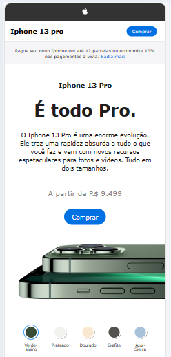

# Projeto: Clone da Página do Iphone 13 Pro
O projeto da página de vendas do iPhone, apresenta uma funcionalidade desenvolvida em JavaScript de mudança da cor do iPhone de acordo com a preferência do cliente, que seleciona a cor clicando nos botões com as cores correspondentes. 
O projeto conta com uma etapa de responsividade, que foi adaptado para telas de celulares até 480px.

## Tecnologias: 
HTML 
CSS 
JAVASCRIPT 
GIT/GITHUB
